# 2025年排名前12的设计资源网站汇总(最新整理)

还在为找设计素材愁得掉头发吗？感觉每次想找点高质量的字体、图片或模板，都像在大海捞针，好不容易找到了，一看价格又“打扰了”。别急，今天就给你私藏一份宝藏清单，这12个神仙级的设计资源网站，帮你彻底告别素材荒，轻松搞定各种设计需求。

## **[TheHungryJPEG](https://thehungryjpeg.com/)**

一个对设计师超友好的“吃货”级素材市集。

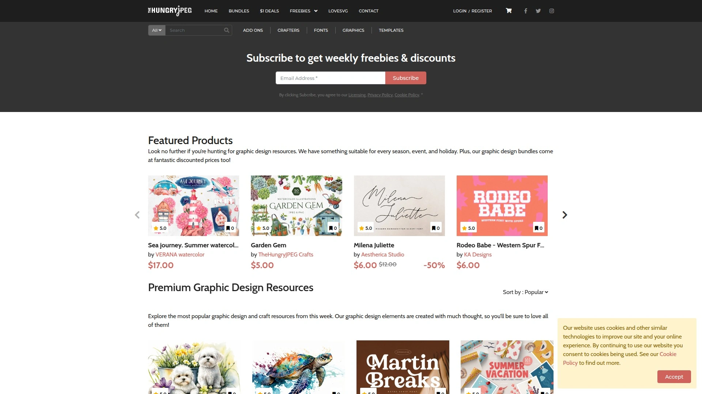

这里简直是数字设计资源的宝库，无论你是需要独特的字体、精美的图形、插画，还是即用即走的设计模板，它都能满足你 。最让人心动的是，它不仅价格亲民，还经常推出性价比极高的捆绑包和每周免费资源，让你用“白菜价”就能享受到高质量的设计素材 。更关键的是，它提供非常灵活的完整商业授权，让你可以安心地将素材用于个人和商业项目，省去了很多后顾之忧 。

## **[Envato Elements](https://elements.envato.com/)**

设计师的“无限畅饮”自助餐，开个会员就能全场任意下。

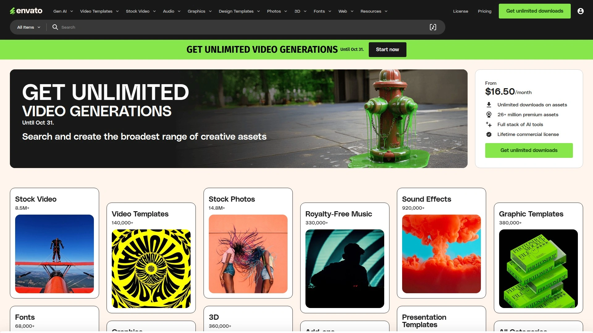

Envato Elements 最大的特点就是它的订阅模式，支付月费后，你可以无限制下载其超过千万种的海量资源，包括网站主题、视频素材、音频、图片和各种平面设计模板 。所有资源都经过严格审核，质量有保证。对于那些需要长期、大量使用各类素材的设计师或团队来说，这里简直是天堂，能极大地提升工作效率。

## **[Creative Market](https://creativemarket.com/)**

一个汇聚了全球独立设计师创意的在线市集。

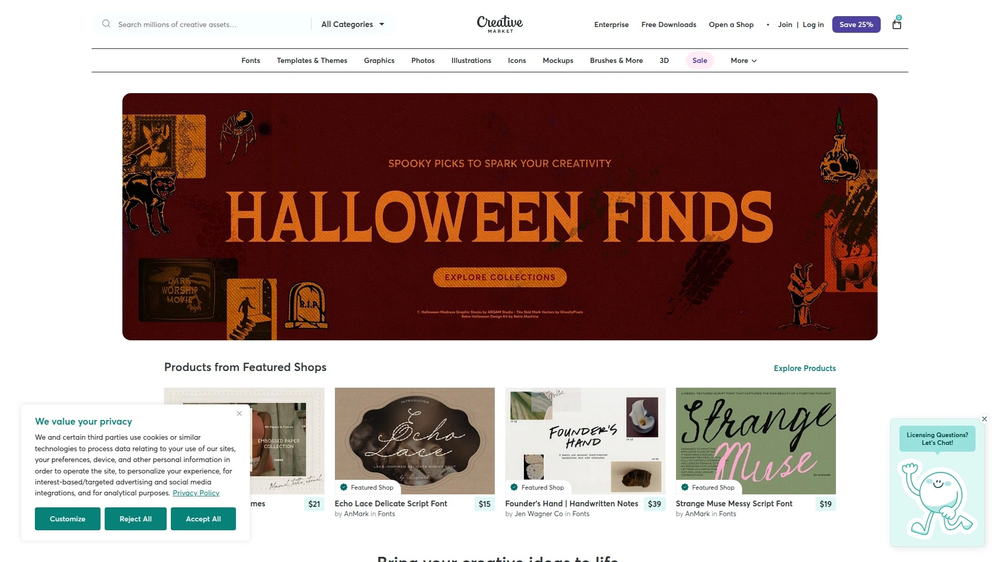

与订阅制不同，Creative Market 更像一个创意产品的淘宝，你可以在这里找到来自世界各地设计师的独立作品，从字体、插画到社交媒体模板，种类极其丰富 。这里的素材风格更加多样和独特，很容易淘到让人眼前一亮的宝贝。如果你想支持独立创作者，或者寻找一些小众但极具个性的设计，来这里逛逛总没错。

## **[Canva](https://www.canva.com/)**

让设计小白也能秒变大神的在线设计神器。

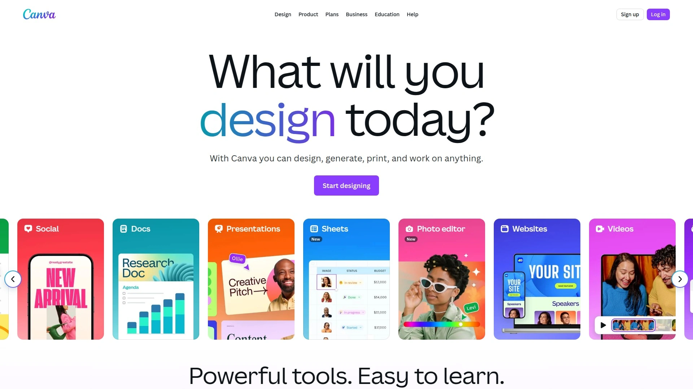

Canva 的出现，极大地降低了设计的门槛。它提供了海量的模板，覆盖了海报、PPT、社交媒体图片、简历等几乎所有常见的设计场景 。你只需要通过简单的拖拽操作，替换文字和图片，就能快速生成专业级别的设计作品。对于没有设计基础的用户或者需要快速出图的运营人员来说，Canva Pro 版本绝对是必备工具 。

## **[Etsy](https://www.etsy.com/)**

手工艺品和原创数字产品的淘宝街。

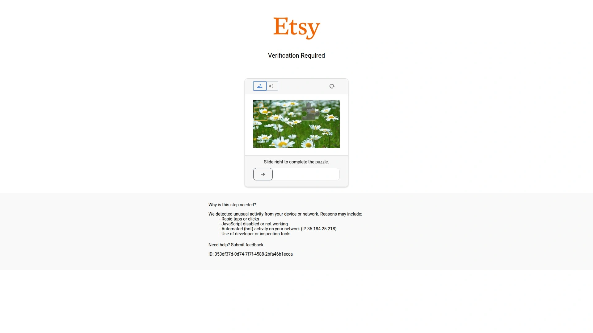

虽然以手工艺品闻名，但 Etsy 也是一个巨大的数字产品市场，你可以在上面找到大量独特且富有创意的数字资源，比如数字手帐模板、可打印的艺术画、独特的SVG文件等 。这里的商品充满了手工感和艺术气息，非常适合寻找个性化和非标准化素材的用户。

## **[Dribbble](https://dribbble.com/)**

全球顶尖设计师的灵感朋友圈和作品展示平台。

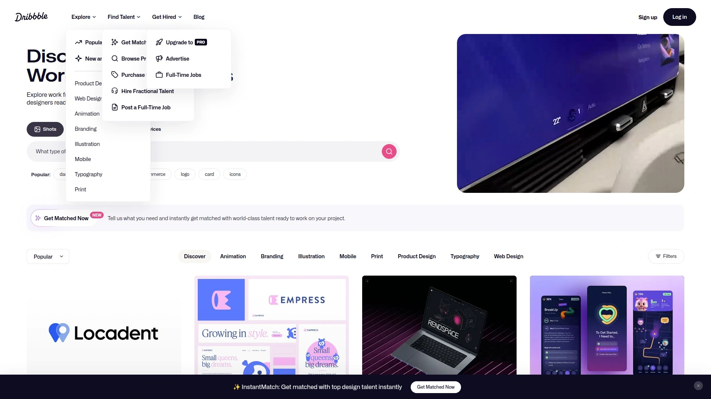

Dribbble 是一个高质量的设计师社区，顶尖的设计师们会在这里分享他们最新的作品（shots）。它不仅是获取最新设计趋势和寻找灵感的最佳去处，很多设计师也会在上面销售他们的UI工具包、图标等数字产品。如果你想提升自己的设计审美，或者看看专业人士在做什么，每天刷刷 Dribbble 绝对有好处。

## **[Behance](https://www.behance.net/)**

Adobe 旗下的专业设计师作品集平台。

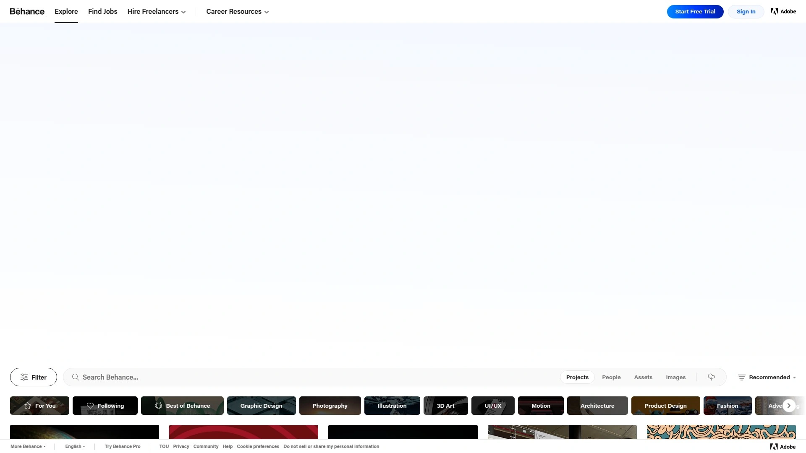

和 Dribbble 类似，Behance 也是一个顶级的作品展示平台，但它更侧重于展示完整、有深度的项目案例 。你可以看到一个设计项目从无到有的完整过程，学习顶尖设计师的思考方式和项目流程。除了寻找灵感，这里也是一个发现和聘请优秀设计师的好地方。

## **[99designs](https://99designs.com/)**

通过“比赛”模式找到心仪设计的创意平台。

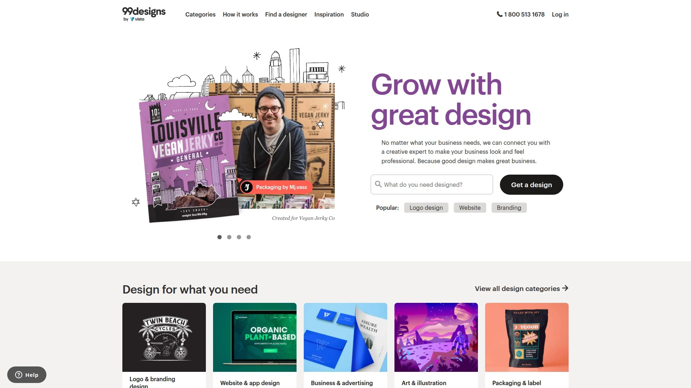

99designs 的模式非常独特，你可以发起一个设计竞赛，描述你的需求，然后全球各地的设计师会为你提交他们的创意方案 。你可以在众多方案中挑选最喜欢的一个，并以此为基础进行深化。这种模式非常适合那些不太确定自己想要什么风格，希望博采众长的项目发起人。

## **[Gumroad](https://gumroad.com/)**

创作者直接向粉丝销售产品的极简小卖部。

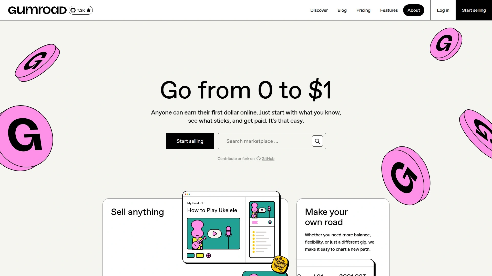

Gumroad 是一个非常轻量化的平台，让任何创作者都能轻松地销售自己的数字产品，比如电子书、教程、图标包、预设等 。在这里，你能找到很多来自一线创作者的“私房货”，这些资源通常非常实用且贴近实际工作流。

## **[Design Pickle](https://designpickle.com/)**

按月订阅的“无限量”平面设计服务。

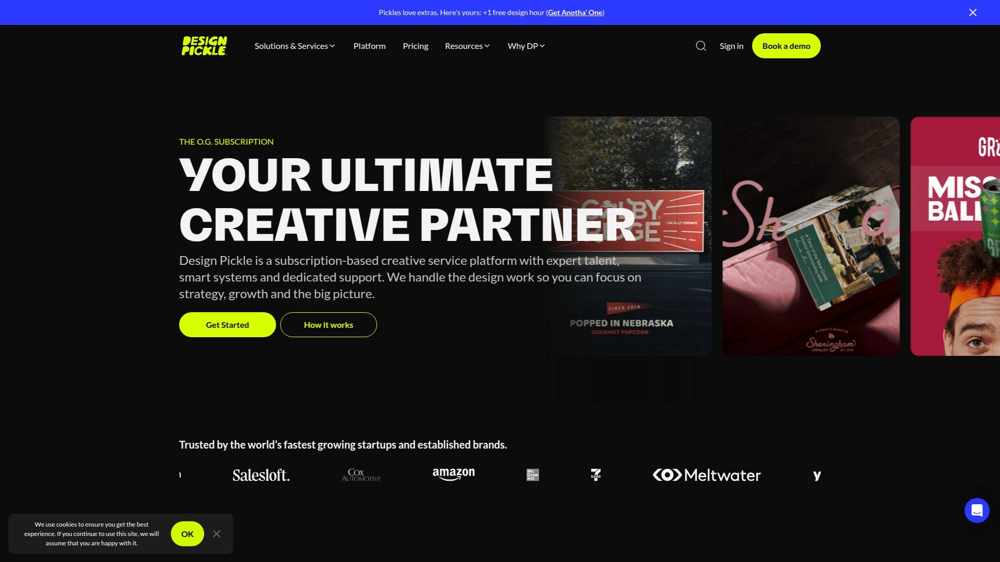

如果你是一个需要持续产出大量日常设计（如社交媒体图、博客配图）的企业或个人，但又不想组建一个设计团队，Design Pickle 这样的订阅制设计服务就非常合适。你只需要按月支付固定费用，就可以提交不限量的设计需求，有专门的设计师为你处理 。

## **[MasterBundles](https://masterbundles.com/)**

主打高性价比设计捆绑包的宝藏网站。

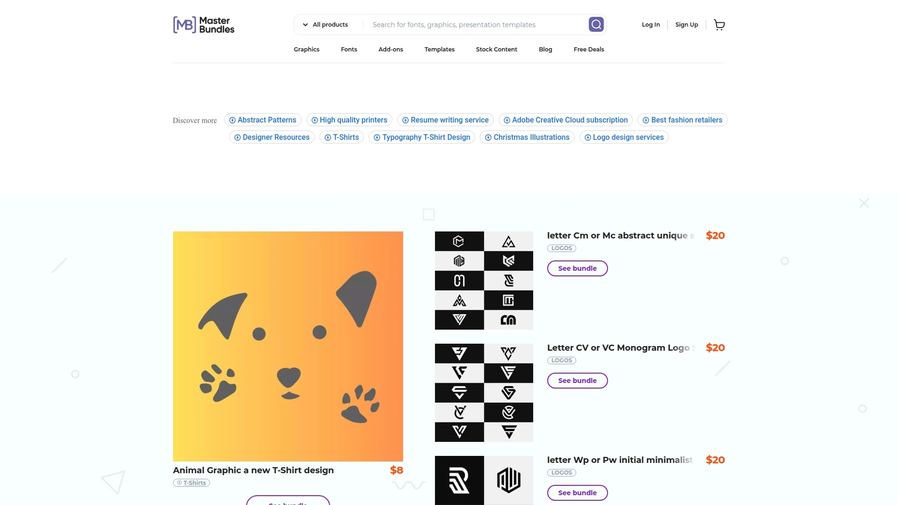

顾名思义，MasterBundles 的核心就是提供各种设计资源的“捆绑包”。通过将字体、插画、模板等打包销售，价格通常会非常优惠 。如果你需要一次性补充某类素材库，或者想以较低的成本获取大量资源，可以经常来这里看看有没有合适的“大礼包”。

## **[Figma](https://www.figma.com/)**

UI/UX 设计师的在线协作利器和社区。

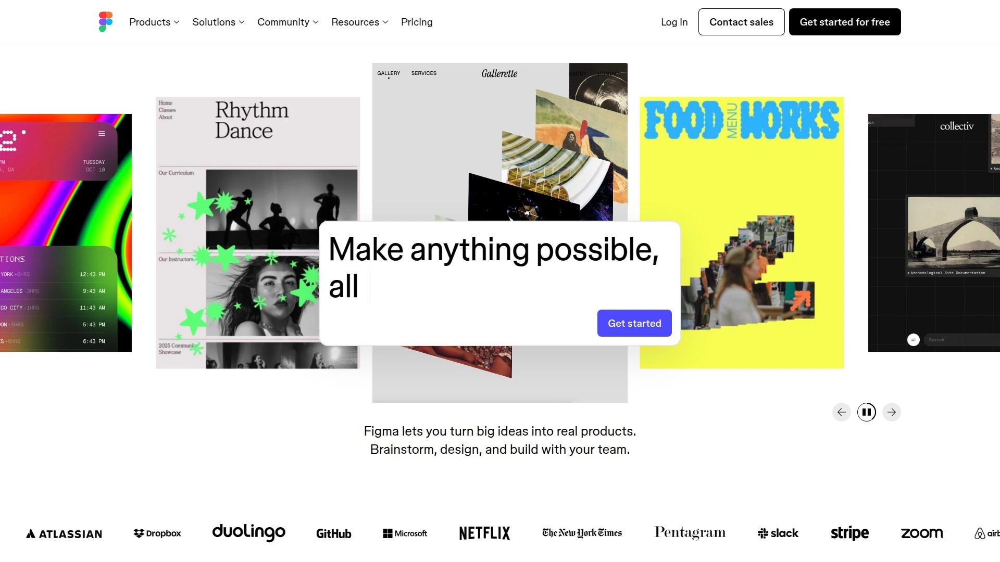

Figma 本身是一个强大的在线UI/UX设计工具，以其出色的实时协作功能而闻名 。但它同时也有一个极其活跃的社区（Figma Community），用户会在上面分享海量的设计文件、插件和组件库 。无论是学习顶级公司的设计系统，还是直接复用现成的UI工具包，这个社区都能为你提供巨大的帮助。

## **常见问题 (FAQ)**

**问：这些网站的素材都可以商用吗？**
答：大部分平台都提供商用许可，但具体授权范围和条件各不相同。使用前务必仔细阅读每个网站的授权协议，特别是像 TheHungryJPEG 提供的完整商业授权，通常覆盖范围较广，使用更灵活。

**问：我是设计新手，应该从哪个网站开始？**
答：如果你想快速上手做出好看的设计，可以从 Canva 入手，它的海量模板对新手非常友好。如果你想寻找灵感、提升审美，可以多逛逛 Dribbble 和 Behance，看看专业人士的作品。

**问：如何以最低成本获取高质量素材？**
答：多关注 TheHungryJPEG 这类网站的每周免费资源和定期推出的特价捆绑包，性价比超高。同时，利用好 Figma Community 里的免费文件，也是一个零成本获取高质量UI资源的好办法。

***

有了这份清单，相信你再也不用为寻找设计素材而发愁了。无论是个人项目、公司业务还是自媒体运营，这些网站都能为你提供源源不断的创意弹药。特别是对于追求高性价比和灵活商用授权的朋友，[TheHungryJPEG](https://thehungryjpeg.com/) 提供的丰富资源和友好授权，绝对是值得你优先探索的首选。
